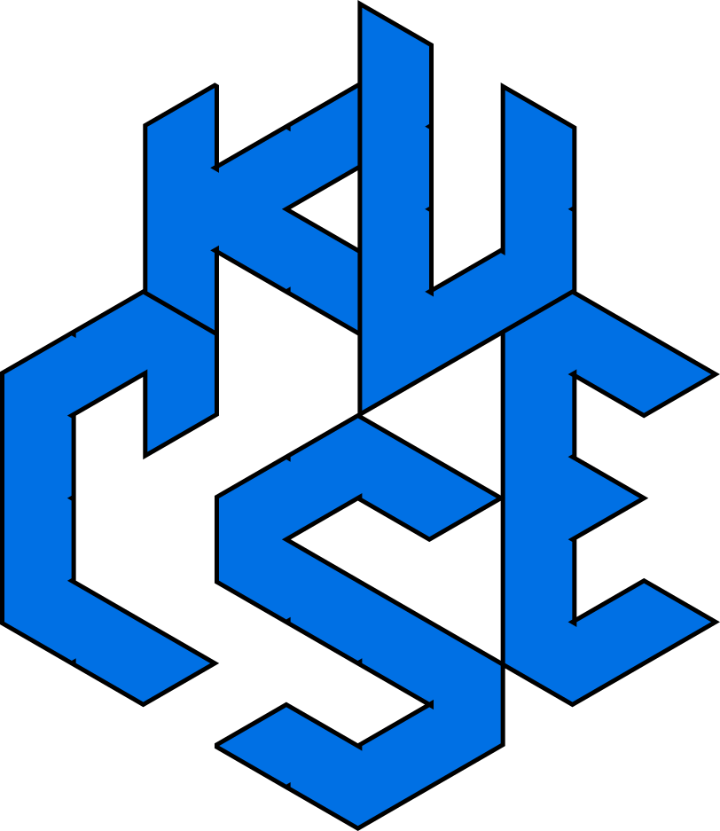

# Contributions

<!--  -->

## Back Story, Our Motivations

During our 1st year 2nd term, me along with my close 3 friends felt necessity of collaboration and assistance to start programming life for beginners. We decided to help our

After our term final examination, during Eid Vacation, my friend, [Ibnul Abrar Shahriar Seam](https://t.me/Anonymous_HF) sent me a link <https://structured-programming-ku-cse.blogspot.com/> and added me as a contributor. Later, my classmates [Azmain Inquaid Haque](https://www.linkedin.com/in/azmain-inquaid-haque-44a4b62b1/), and [Joydeb Gan Prokas (Durjay)](https://www.linkedin.com/in/joydeb-gan-prokas-a33667286/) directly contributed to this book.

Later, [a lot happened](https://en.wikipedia.org/wiki/2024_Bangladesh_quota_reform_movement), we achieved the 2nd independence of Bangladesh on "36th July 2024" (05 August 2024) with the heroic patriotism of [Abu Sayed Vai](https://youtu.be/FdwWlU4SSjs?si=dp10wmAFPP5FXAfE), [Mir Mugdha Vai](https://youtu.be/S08aMjlgfis?si=oQB7oA6UuWj_DWrn), [and many more](https://en.prothomalo.com/bangladesh/1hmcovbabm) which motivated us to share our knowledge and thoughts to build this nation. To make it freely available for everyone and everyone's contribution, we decided to make it open by hosting in Github with mdBook.

We look forward to rebuild our motherland as well as making this world better.

***

...

<!-- Kazi Rifat Morshed
KU CSE, 23 Batch, Student ID: 230220   -->
