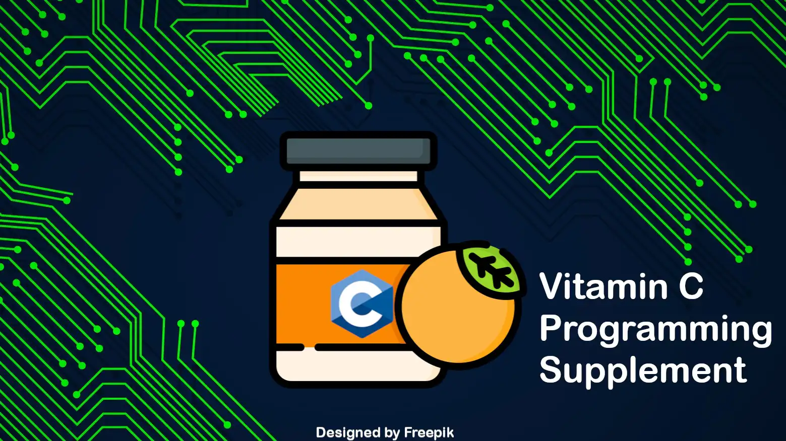

# Welcome

$$ \text{Vitamin C Programming Supplement} $$

Welcome to Vitamin C Programming Supplement. It is a guide like book for programming beginners focusing on the C Programming Language. A lot of resources are available online, but we're here to make a compilation (gather necessary resources here) as well as exercises to enhance your programming skills.

We have tried to make this content easy as possible from a Bangladeshi point of view and written exams. Furthermore, we will be sharing our notes on Programming fundamentals and the C programming language.

It takes a lot of time to master a programming language. You need to put in practice and dedication to achieve proficiency. You can't just read books or watch tutorials; you have to write code yourself and try new things (explore!).

This book is prepared as a supplement to your mainstream learning resource (like YouTube playlists or any books). After completing topics from your main learning source, you can find additional information/knowledge and some practice problems here. Do not take this book as your main book to learn as we have skipped many essential topics believing that you will learn them in your class or YouTube lecture or from books.

<!-- done -->